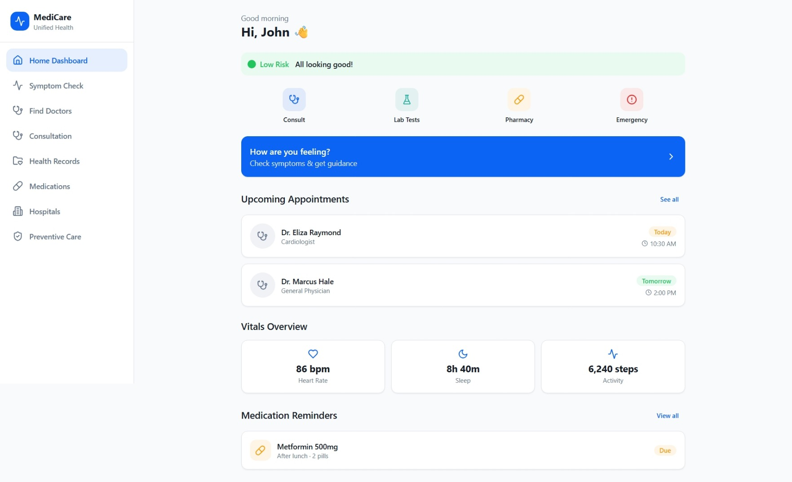
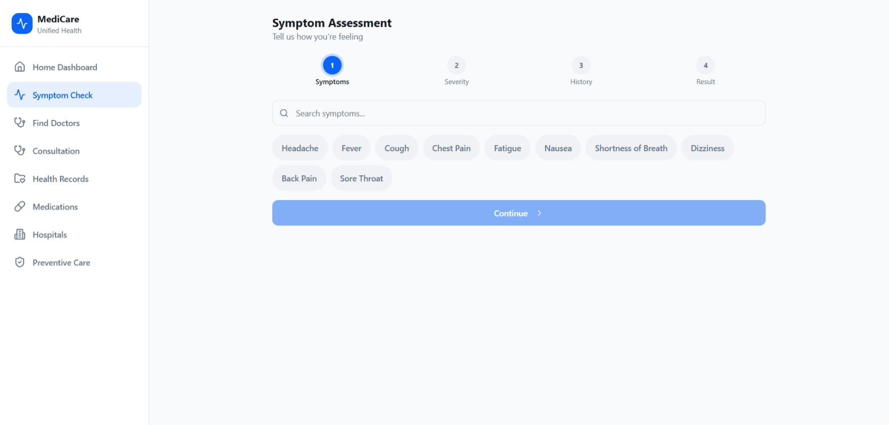
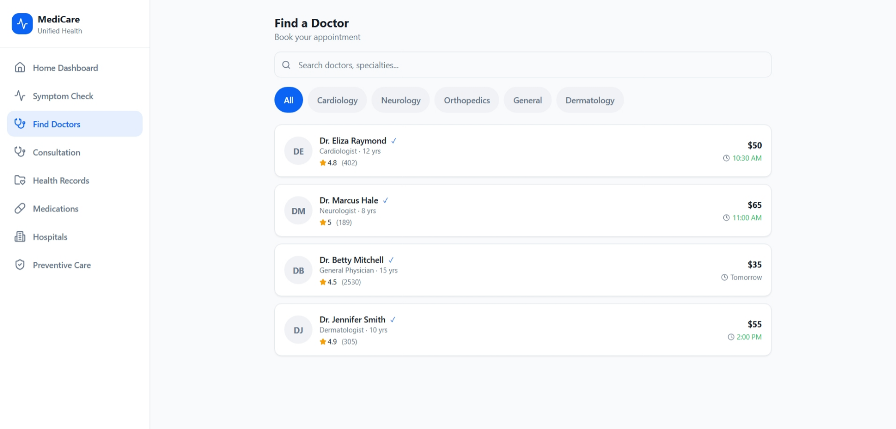
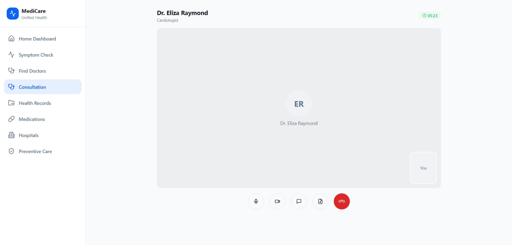
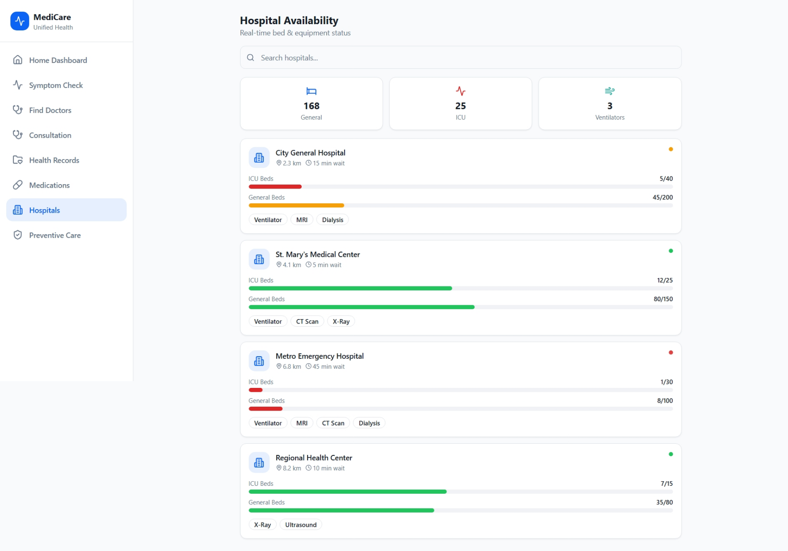
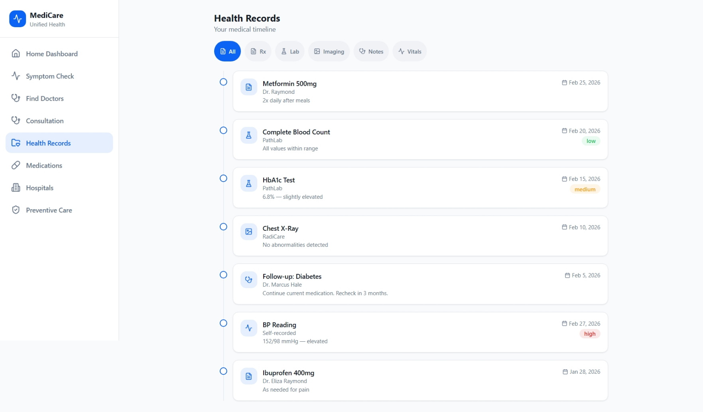
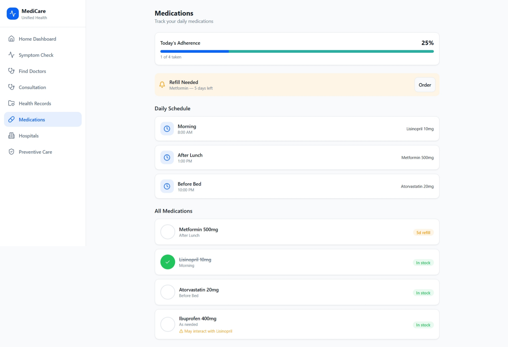
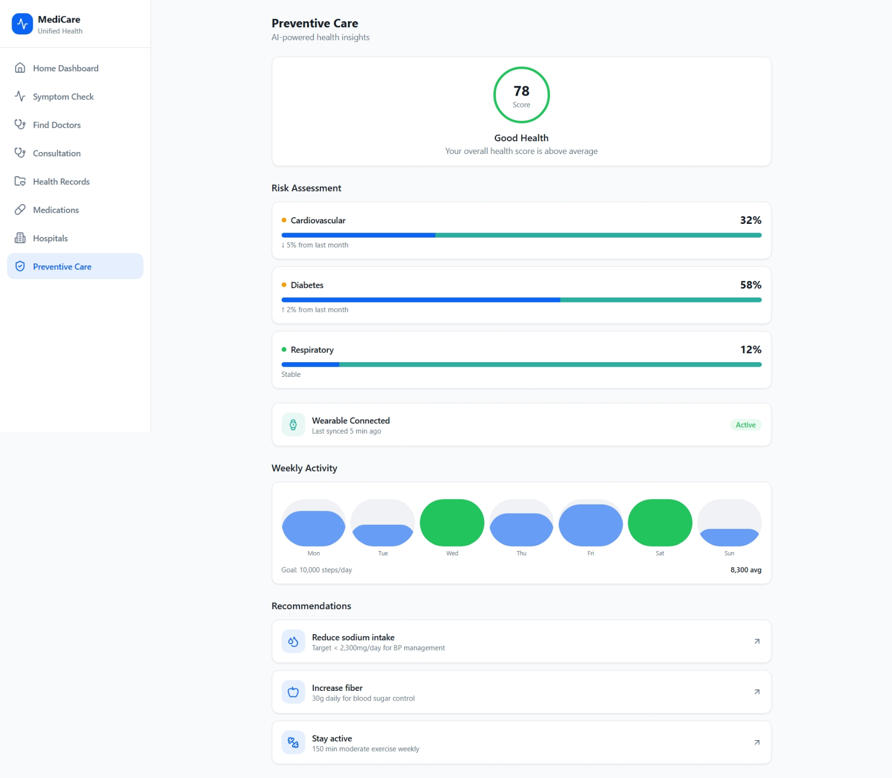
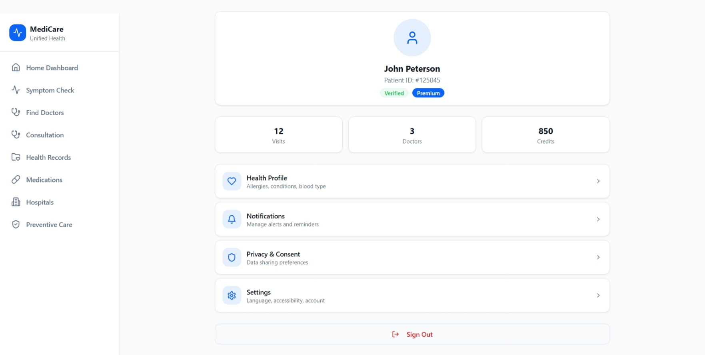

# Health Navigator - UI Presentation Project

## Overview

**Health Navigator** is a comprehensive healthcare management UI designed for presentation purposes. This is a **UI-only demonstration project** showcasing a modern, responsive interface for managing healthcare services, consultations, medical records, and preventive care.

> **Note:** This project is designed as a visual prototype and presentation demo. It demonstrates UI/UX design patterns and user workflows without backend integration.


## Project Purpose

This UI prototype demonstrates:
- Modern healthcare application design patterns
- User-friendly interfaces for medical consultations
- Electronic Health Records (EHR) visualization
- Medication and appointment tracking
- Responsive navigation and layouts
- Professional healthcare UX workflows


## Pages & Features

### 1. **Home Dashboard** (`HomeDashboard.tsx`)
Main landing page providing an overview of healthcare services and quick access to key features.



### 2. **Symptom Intake** (`SymptomIntake.tsx`)
User-friendly form for patients to report symptoms and health concerns.



### 3. **Doctor Listing** (`DoctorListing.tsx`)
Browse and view available doctors with their specializations and availability.



### 4. **Consultation Screen** (`ConsultationScreen.tsx`)
Interface for scheduling and managing doctor consultations.



### 5. **Hospital Availability** (`HospitalAvailability.tsx`)
View hospital services, bed availability, and facility information.



### 6. **EHR Timeline** (`EHRTimeline.tsx`)
Electronic Health Records displayed in a timeline format for easy medical history review.



### 7. **Medication Tracker** (`MedicationTracker.tsx`)
Track medications, dosages, and refill schedules.



### 8. **Preventive Dashboard** (`PreventiveDashboard.tsx`)
Health insights and preventive care recommendations.



### 9. **Services Screen** (`ServicesScreen.tsx`)
Overview of available healthcare services and offerings.


### 10. **Profile Screen** (`ProfileScreen.tsx`)
User profile management and personal health information.




## Project Structure

```
src/
├── pages/              # Main page components
├── components/         # Reusable components
│   ├── healthcare/     # Health-specific components (MedicalCard, StatusBadge, etc.)
│   ├── layout/         # Layout components (AppLayout)
│   └── ui/             # UI primitives (buttons, cards, dialogs, etc.)
├── hooks/              # Custom React hooks
├── lib/                # Utility functions
├── App.tsx             # Main application component
├── main.tsx            # Entry point
└── index.css           # Global styles
```


## Technology Stack

- **React** - UI library
- **TypeScript** - Type safety
- **Vite** - Build tool
- **Tailwind CSS** - Styling (via shadcn/ui components)
- **shadcn/ui** - Component library


## UI Components

The project includes a comprehensive set of reusable components:

### Healthcare-Specific Components:
- `MedicalCard` - Display medical information
- `StatusBadge` - Status indicators
- `SeverityIndicator` - Health severity levels
- `ProgressSteps` - Multi-step workflows
- `EmptyState`, `ErrorState`, `LoadingState` - State management UI

### UI Primitives:
- Buttons, Cards, Dialogs, Forms
- Tables, Charts, Progress bars
- Accordions, Tabs, Badges
- Navigation menus, Sidebars
- And 40+ more shadcn/ui components


## 🚀 Getting Started

1. **Install dependencies:**
   ```bash
   npm install
   ```

2. **Run development server:**
   ```bash
   npm run dev
   ```

3. **Build for production:**
   ```bash
   npm run build
   ```

4. **View the application:**
   Open your browser and navigate to the local dev server URL (typically `http://localhost:5173`)


## Important Notes

- **No Backend Integration:** This is a frontend-only prototype. API calls are not implemented.
- **Mock Data:** Any data displayed is for demonstration purposes only.
- **Presentation Ready:** All UI states (loading, error, empty) are implemented and ready to showcase.
